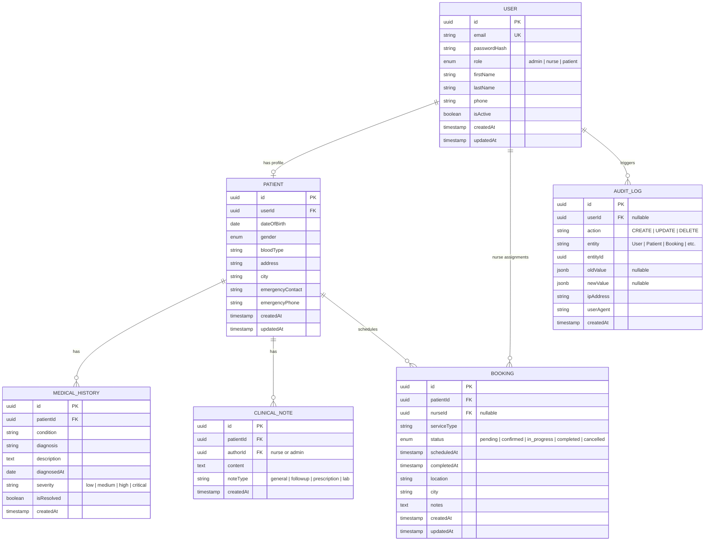

# CURE Healthcare Backend — NestJS Implementation Plan

> **Goal:** Build a high-throughput, production-ready RESTful API for CURE's healthcare operations using NestJS, PostgreSQL, Redis, Docker, and Swagger — following Clean Architecture with Service Layer + Repository patterns.

---

## Technology Choices & Justification

| Technology | Purpose | Why |
|---|---|---|
| **NestJS** | Framework | Modular architecture, built-in DI, decorators, guards, pipes — perfect for Clean Architecture |
| **TypeORM** | ORM / Repository Pattern | First-class NestJS integration, decorator-based entities, migration support, repository pattern built-in |
| **PostgreSQL** | Primary Database | ACID compliance for transactional booking, relational integrity for medical data |
| **Redis** | Caching & Rate Limiting | In-memory speed for session/token blacklisting and rate-limit counters |
| **Docker + Compose** | Containerization | Reproducible environments; orchestrates app + Postgres + Redis |
| **Swagger (OpenAPI)** | API Documentation | Auto-generated from NestJS decorators, interactive testing UI |
| **Argon2id** | Password Hashing | Superior to bcrypt — memory-hard, resistant to GPU/ASIC attacks |
| **class-validator + class-transformer** | Payload Validation | Declarative DTO validation, prevents SQLi/XSS at the edge |

---

## Project Structure (Clean / Layered Architecture)

```
server/
├── src/
│   ├── main.ts                          # Bootstrap, Swagger setup, global pipes
│   ├── app.module.ts                    # Root module
│   │
│   ├── config/                          # Configuration module
│   │   ├── config.module.ts
│   │   ├── database.config.ts           # TypeORM config
│   │   ├── redis.config.ts              # Redis config
│   │   └── jwt.config.ts               # JWT secrets & TTLs
│   │
│   ├── common/                          # Shared utilities
│   │   ├── decorators/                  # Custom decorators (@CurrentUser, @Roles)
│   │   ├── guards/                      # JwtAuthGuard, RolesGuard
│   │   ├── interceptors/               # AuditLogInterceptor, TransformInterceptor
│   │   ├── filters/                     # GlobalExceptionFilter
│   │   ├── pipes/                       # Custom validation pipes
│   │   ├── dto/                         # Shared DTOs (PaginationDto, ApiResponse)
│   │   └── enums/                       # Role, BookingStatus, etc.
│   │
│   ├── modules/
│   │   ├── auth/                        # 🔐 Identity & RBAC
│   │   │   ├── auth.module.ts
│   │   │   ├── auth.controller.ts       # /auth/register, /login, /refresh, /logout
│   │   │   ├── auth.service.ts          # Business logic
│   │   │   ├── strategies/              # JwtStrategy, JwtRefreshStrategy
│   │   │   └── dto/                     # RegisterDto, LoginDto, TokenResponseDto
│   │   │
│   │   ├── users/                       # User management
│   │   │   ├── users.module.ts
│   │   │   ├── users.controller.ts      # /users CRUD (Admin only)
│   │   │   ├── users.service.ts
│   │   │   ├── users.repository.ts      # Custom repository
│   │   │   ├── entities/
│   │   │   │   └── user.entity.ts       # id, email, password, role, profile
│   │   │   └── dto/
│   │   │
│   │   ├── patients/                    # 🏥 Clinical Data Engine
│   │   │   ├── patients.module.ts
│   │   │   ├── patients.controller.ts   # /patients CRUD + medical history
│   │   │   ├── patients.service.ts
│   │   │   ├── patients.repository.ts
│   │   │   ├── entities/
│   │   │   │   ├── patient.entity.ts
│   │   │   │   ├── medical-history.entity.ts
│   │   │   │   └── clinical-note.entity.ts
│   │   │   └── dto/
│   │   │
│   │   ├── bookings/                    # 📅 Transactional Booking Engine
│   │   │   ├── bookings.module.ts
│   │   │   ├── bookings.controller.ts   # /bookings CRUD + status transitions
│   │   │   ├── bookings.service.ts      # Transactional logic with isolation
│   │   │   ├── bookings.repository.ts
│   │   │   ├── entities/
│   │   │   │   └── booking.entity.ts
│   │   │   └── dto/
│   │   │
│   │   └── audit/                       # 📝 Audit Logging Ledger
│   │       ├── audit.module.ts
│   │       ├── audit.service.ts
│   │       ├── entities/
│   │       │   └── audit-log.entity.ts  # Immutable log entries
│   │       └── dto/
│   │
│   └── database/
│       ├── migrations/                  # TypeORM migrations
│       └── seeds/                       # Seed data (admin user, etc.)
│
├── test/                                # E2E tests
├── .env.example                         # Environment template
├── .env                                 # Local env (gitignored)
├── docker-compose.yml                   # App + Postgres + Redis
├── Dockerfile                           # Multi-stage build
├── tsconfig.json
├── package.json
└── README.md
```

---

## Database Schema Design

### Entity Relationship Diagram



---

## Phase-by-Phase Implementation

### Phase 1 — Project Scaffolding & Configuration

> **Files:** `main.ts`, `app.module.ts`, `config/*`, `.env`, `docker-compose.yml`, `Dockerfile`

- Scaffold NestJS project with `@NestJS/cli`
- Configure `ConfigModule` with `.env` validation using `Joi`
- Set up TypeORM connection to PostgreSQL
- Set up Redis connection via `@NestJS/cache-manager` + `cache-manager-redis-yet`
- Set up global validation pipe (`class-validator`, whitelist + forbidNonWhitelisted)
- Set up global exception filter with standardized error responses
- Set up Swagger with `@NestJS/swagger` (title, description, bearer auth, tags)
- Create Docker Compose with `postgres:16`, `redis:7`, and the app service
- Create multi-stage `Dockerfile` (build → production)

---

### Phase 2 — Common Infrastructure

> **Files:** `common/*`

#### Guards
- **JwtAuthGuard** — extends `AuthGuard('jwt')`, handles token extraction & validation
- **RolesGuard** — reads `@Roles()` metadata, compares against `req.user.role`

#### Decorators
- **@CurrentUser()** — param decorator extracting user from request
- **@Roles(...roles)** — sets metadata for `RolesGuard`
- **@Public()** — marks routes as public (skips auth)

#### Interceptors
- **TransformInterceptor** — wraps all responses in `{ success, data, message, timestamp }`
- **AuditLogInterceptor** — intercepts CUD operations, delegates to `AuditService`

#### Filters
- **GlobalExceptionFilter** — catches all exceptions, returns consistent error shape with appropriate HTTP codes

#### Shared DTOs
- **PaginationQueryDto** — `page`, `limit`, `sortBy`, `sortOrder`
- **PaginatedResponseDto\<T\>** — `data`, `meta: { page, limit, total, totalPages }`

---

### Phase 3 — Auth Module (Identity & RBAC)

> **Files:** `modules/auth/*`, `modules/users/*`

#### Endpoints

| Method | Route | Access | Description |
|---|---|---|---|
| POST | `/auth/register` | Public | Register new user (patient by default) |
| POST | `/auth/login` | Public | Login → returns access + refresh tokens |
| POST | `/auth/refresh` | Public (refresh token) | Rotate refresh token |
| POST | `/auth/logout` | Authenticated | Blacklist refresh token in Redis |
| GET | `/auth/me` | Authenticated | Get current user profile |

#### Implementation Details
- **Argon2id** for password hashing (via `argon2` npm package)
- **Access Token**: short-lived (15 min), contains `sub`, `email`, `role`
- **Refresh Token**: long-lived (7 days), stored hashed in DB, blacklistable via Redis
- **Token Rotation**: on refresh, old refresh token is invalidated
- **JwtStrategy**: validates access token, attaches user to request
- **JwtRefreshStrategy**: validates refresh token against DB hash
- Admin can create users with any role; self-registration defaults to `patient`

---

### Phase 4 — Clinical Data Engine (Patients Module)

> **Files:** `modules/patients/*`

#### Endpoints

| Method | Route | Access | Description |
|---|---|---|---|
| POST | `/patients` | Admin | Create patient profile |
| GET | `/patients` | Admin, Nurse | List patients (paginated + filtered) |
| GET | `/patients/:id` | Admin, Nurse, Own Patient | Get patient details |
| PATCH | `/patients/:id` | Admin, Own Patient | Update patient profile |
| DELETE | `/patients/:id` | Admin | Soft-delete patient |
| POST | `/patients/:id/medical-history` | Admin, Nurse | Add medical history entry |
| GET | `/patients/:id/medical-history` | Admin, Nurse, Own Patient | List medical history (paginated) |
| POST | `/patients/:id/clinical-notes` | Admin, Nurse | Add clinical note |
| GET | `/patients/:id/clinical-notes` | Admin, Nurse, Own Patient | List clinical notes (paginated) |

#### Implementation Details
- **Filtering**: by `city`, `bloodType`, `gender`, `name` (partial match via `ILIKE`)
- **Pagination**: offset-based with configurable `limit` (default 20, max 100)
- **Sorting**: by `createdAt`, `firstName`, `lastName`
- **Sanitization**: all text inputs trimmed and sanitized (strip HTML tags)
- **Ownership check**: patients can only view/edit their own records
- **Soft delete**: `isActive` flag + `deletedAt` timestamp (using TypeORM `@DeleteDateColumn`)

---

### Phase 5 — Transactional Booking Engine

> **Files:** `modules/bookings/*`

#### Endpoints

| Method | Route | Access | Description |
|---|---|---|---|
| POST | `/bookings` | Admin, Patient | Create a booking |
| GET | `/bookings` | Admin, Nurse (own), Patient (own) | List bookings (paginated + filtered) |
| GET | `/bookings/:id` | Admin, Assigned Nurse, Own Patient | Get booking details |
| PATCH | `/bookings/:id` | Admin, Assigned Nurse | Update booking |
| PATCH | `/bookings/:id/status` | Admin, Assigned Nurse | Transition booking status |
| DELETE | `/bookings/:id` | Admin | Cancel booking |

#### Implementation Details

##### Booking Conflict Prevention — Defense in Depth

Two layers of protection guarantee that no double-booking can ever occur:

```
Incoming Request (POST /bookings)
         │
         ▼
┌─────────────────────────────────────┐
│         Open QueryRunner            │
│   startTransaction('SERIALIZABLE')  │
└─────────────────────────────────────┘
         │
         ▼
┌─────────────────────────────────────┐
│      Pessimistic Write Lock         │  ← First line of defense
│                                     │
│  SELECT * FROM bookings             │
│  WHERE nurseId = ?                  │
│  AND scheduledAt = ?                │
│  AND status NOT IN ('cancelled')    │
│  FOR UPDATE                         │
│                                     │
│  If conflict found → throw          │
│  ConflictException immediately      │
│  + ROLLBACK                         │
└─────────────────────────────────────┘
         │
         │ No conflict found
         ▼
┌─────────────────────────────────────┐
│         INSERT INTO bookings        │
│                                     │
│  DB Unique Partial Index kicks in   │  ← Second line of defense
│                                     │
│  UNIQUE (nurseId, scheduledAt)      │
│  WHERE status NOT IN ('cancelled')  │
│                                     │
│  If two requests slipped through    │
│  simultaneously → DB throws         │
│  error code 23505                   │
└─────────────────────────────────────┘
         │
         ▼
┌─────────────────────────────────────┐
│           Error Handler             │
│                                     │
│  catch (error) {                    │
│    if (error.code === '23505')      │
│      → ConflictException            │
│        "This time slot is already   │
│         booked"                     │
│    else                             │
│      → rethrow original error       │
│  }                                  │
│  finally → queryRunner.release()    │
└─────────────────────────────────────┘
         │
         ▼
      ✅ One booking saved
      ❌ All others rejected cleanly
```

##### Why Two Layers?

| Layer | What it does | Gap it covers |
|---|---|---|
| **Pessimistic Lock (`FOR UPDATE`)** | Blocks concurrent transactions on the same rows — handles 99.9% of conflicts gracefully with a clean `ConflictException` | Cannot lock rows that **don't exist yet** (phantom read problem — two transactions both see "no conflict" when no prior booking exists) |
| **Unique Partial Index** | Database-level constraint: `UNIQUE (nurseId, scheduledAt) WHERE status NOT IN ('cancelled')` — guaranteed safety net that never fails | Catches the phantom read edge case and any application-level bugs; translates raw DB error `23505` into a clean `ConflictException` |

> **Defense in Depth**: The lock handles the common case gracefully. The index is the guaranteed safety net. Together, no booking conflict can ever slip through.

##### Database Migration — Partial Index
```sql
CREATE UNIQUE INDEX idx_booking_nurse_schedule_active
ON bookings ("nurseId", "scheduledAt")
WHERE status NOT IN ('cancelled');
```

##### Status State Machine
```
pending → confirmed → in_progress → completed
pending → cancelled
confirmed → cancelled
```
Invalid transitions rejected with `400 Bad Request`.

##### Other Details
- **Geographical Constraints**: filter by `city`/`location`, nurse assignment constrained to same city
- **Filtering**: by `status`, `nurseId`, `patientId`, `city`, `scheduledAt` date range
- **Caching**: cache frequently accessed booking lists in Redis (invalidated on mutation)

---

### Phase 6 — Security Hardening

#### Rate Limiting
- Use `@NestJS/throttler` with Redis store
- Global: 100 requests / 60 seconds per IP
- Auth endpoints: 5 requests / 60 seconds per IP (brute-force protection)

#### Input Validation & Sanitization
- Global `ValidationPipe` with `whitelist: true`, `forbidNonWhitelisted: true`
- `class-validator` decorators on all DTOs
- `class-transformer` for type coercion
- Custom sanitizer pipe stripping HTML/script tags (using `sanitize-html` or similar)

#### Security Headers
- Use `helmet` middleware for HTTP security headers
- Enable CORS with configurable allowed origins

#### SQL Injection Prevention
- TypeORM parameterized queries (never raw string concatenation)
- All user input passes through DTO validation before reaching the service layer

---

### Phase 7 — Audit Logging Ledger

> **Files:** `modules/audit/*`, `common/interceptors/audit-log.interceptor.ts`

#### Design
- **Immutable**: audit_log table has no UPDATE or DELETE operations exposed
- **Interceptor-based**: `AuditLogInterceptor` captures all `POST`, `PATCH`, `PUT`, `DELETE` requests
- **Captures**: userId, action, entity name, entityId, old value (for updates), new value, IP address, user agent, timestamp
- **Query endpoint**: `GET /audit-logs` (Admin only, paginated, filterable by entity, action, userId, date range)

---

### Phase 8 — Docker & Documentation

#### Docker Compose Services

| Service | Image | Port |
|---|---|---|
| `app` | Custom `Dockerfile` | 3000 |
| `postgres` | `postgres:16-alpine` | 5432 |
| `redis` | `redis:7-alpine` | 6379 |

#### Dockerfile
- Multi-stage build: `node:20-alpine` for build, `node:20-alpine` for runtime
- Non-root user, minimal image size
- Health check endpoint (`GET /health`)

#### Swagger
- Available at `/api/docs`
- Bearer token auth configured
- All endpoints documented with request/response schemas
- Grouped by tags (Auth, Users, Patients, Bookings, Audit)

#### README.md
- Project overview, architecture diagram
- Setup instructions (Docker + manual)
- Environment variables reference
- API endpoints summary
- Commit convention guide

---

### Phase 9 — Final Polish

- **Health Check**: `GET /health` endpoint returning DB + Redis connectivity status (using `@NestJS/terminus`)
- **Seed Script**: creates default admin user + sample data for demo
- **Environment Validation**: app fails fast if required env vars are missing
- **Logging**: structured logging with `NestJS-pino` or built-in Logger
- **Semantic Commits**: `feat:`, `fix:`, `docs:`, `chore:`, `refactor:`, `test:`

---

## Verification Plan

### Automated Tests
```bash
# Unit tests
npm run test

# E2E tests
npm run test:e2e

# Test coverage
npm run test:cov
```

### Manual Verification
- Start with `docker compose up` — verify all services healthy
- Test full auth flow (register → login → refresh → logout) via Swagger UI
- Test RBAC by attempting cross-role operations
- Test booking conflict detection (double-booking same nurse at same time)
- Test pagination, filtering, and sorting on all list endpoints
- Test rate limiting by exceeding threshold
- Verify audit logs capture all CUD operations
- Test with invalid/malicious input (XSS payloads, SQL injection attempts)

---

## Open Questions

> [!IMPORTANT]
> **Database choice**: The spec allows PostgreSQL or MongoDB. This plan uses **PostgreSQL** due to the transactional isolation requirements of the booking engine. Are you okay with this choice?

> [!IMPORTANT]
> **File uploads**: The spec mentions "patient files" under Clinical Data Engine. Should we implement file upload (e.g., lab results, medical images) using local storage or a cloud provider like S3, or should we skip file uploads and just store structured text data?

> [!NOTE]
> **Notification system**: The spec doesn't mention notifications, but a booking system often benefits from email/SMS notifications. Should we add this as a bonus feature, or keep it out of scope?

> [!NOTE]
> **gRPC vs REST**: The spec allows either REST or gRPC. This plan uses **REST** since it's more straightforward for Swagger documentation and the evaluation criteria. Let me know if you prefer gRPC.
